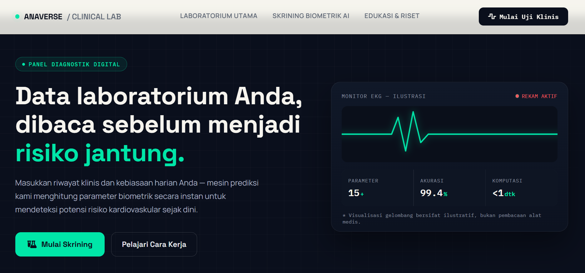
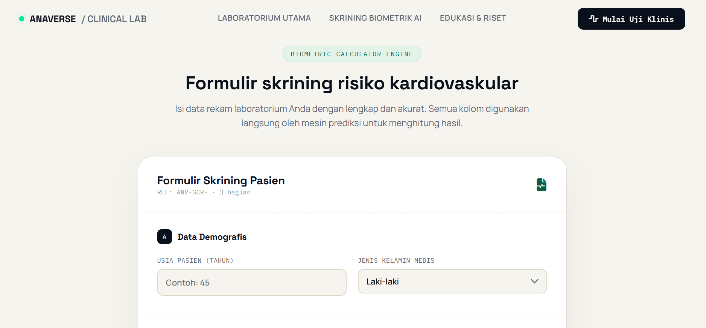
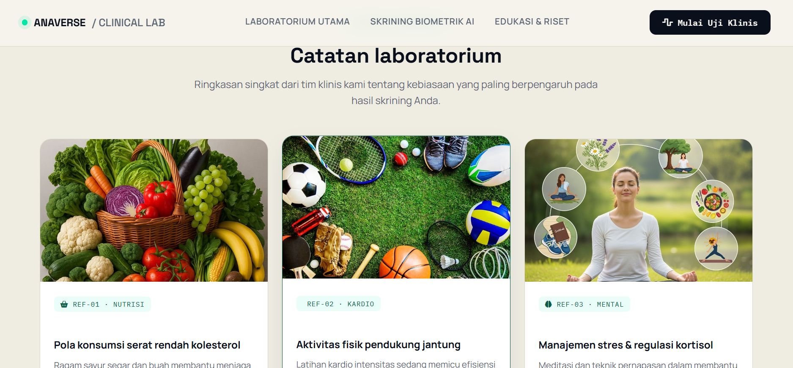
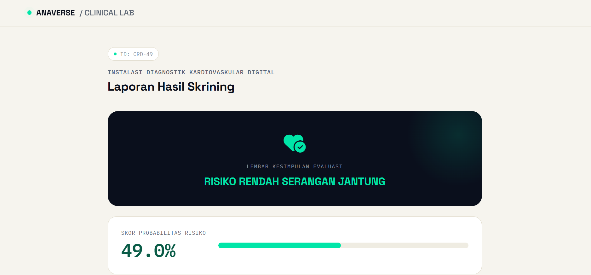

# 🫀 Anaverse Clinical - Heart Attack Risk Prediction System

**Anaverse Clinical** adalah aplikasi berbasis web yang memanfaatkan model *Machine Learning* untuk mendeteksi dan melakukan penapisan (*screening*) awal risiko serangan jantung secara instan dan presisi. Sistem ini mengintegrasikan pemrosesan data medis dengan antarmuka web modern berbasis **Flask** dan **Bootstrap**.

---

## 👨‍🎓 Identitas Pengembang


- **Nama:** Syifa Kanita Putri G
- **Kelas:** 4C
- **Mata Kuliah:** UAI KECERDASAN BUATAN
- **NIM:** 301240016

---

## 🖥️ Antarmuka & Penjelasan Tampilan Web

Aplikasi web **Anaverse Clinical** memiliki beberapa bagian antarmuka utama yang dirancang intuitif, responsif, dan bernuansa laboratorium klinis modern:

### 1. Main Hero & Panel Diagnostik Digital
<p align="center">
  
</p>

Halaman awal yang menyambut pengguna dengan tampilan *dark theme* futuristik. Halaman ini berfungsi memberikan gambaran umum mengenai sistem prediktif, jumlah parameter biometrik yang diolah (15+ parameter), estimasi akurasi model, serta kecepatan komputasi prediksi (< 1 detik). Terdapat navigasi utama dan tombol **"Mulai Skrining"** untuk langsung menuju ke formulir pemeriksaan.

---

### 2. Formulir Skrining Biometrik Pasien
<p align="center">
  
</p>

Halaman formulir input data rekam medis pasien (*Biometric Calculator Engine*). Di bagian ini, pengguna atau tenaga medis memasukkan data biometrik secara akurat yang terbagi ke dalam beberapa bagian:
- **Data Demografis:** Usia pasien dan Jenis Kelamin Medis.
- **Kondisi Klinis & Gaya Hidup:** Tekanan darah, kadar kolesterol, riwayat merokok, aktivitas fisik, pola tidur, hingga hasil EKG.

---

### 3. Catatan Laboratorium & Edukasi Klinis
<p align="center">
  
</p>

Bagian khusus yang menyajikan kartu edukasi kesehatan (*Clinical Notes*) seputar kebiasaan harian yang paling mempengaruhi hasil skrining kesehatan jantung. Fitur ini dirancang untuk memberikan wawasan tambahan mengenai:
- **Nutrisi:** Pola konsumsi serat dan makanan rendah kolesterol.
- **Kardio:** Pentingnya aktivitas fisik dan latihan kardio pendukung fungsi jantung.
- **Mental:** Manajemen stres dan regulasi hormon kortisol.

---

### 4. Laporan Hasil Skrining (Halaman Prediksi)
<p align="center">
  
</p>

Halaman luaran (*output*) yang menampilkan lembar kesimpulan evaluasi dari model *Machine Learning*. Halaman ini memuat:
- **Status Diagnosis:** Klasifikasi tingkat risiko dalam bentuk *badge* visual kontras (misalnya **RISIKO RENDAH SERANGAN JANTUNG** atau **RISIKO TINGGI SERANGAN JANTUNG**).
- **Skor Probabilitas Risiko:** Persentase kemungkinan tingkat risiko pasien yang dihitung secara presisi lengkap dengan indikator *progress bar* visual.

---

## 🛠️ Teknologi yang Digunakan

- **Backend Framework:** Python, Flask
- **Machine Learning Engine:** Scikit-Learn, Pandas, NumPy, Pickle
- **Algorithm & Scaler:** Random Forest Classifier & StandardScaler
- **Frontend Design:** HTML5, CSS3, Bootstrap 5, Jinja2 Template Engine
- **Deployment/Tunneling:** LocalTunnel (Node.js)

---

## 🚀 Cara Menjalankan Aplikasi Secara Lokal

1. **Clone Repositori Ini:**
   ```bash
   git clone [https://github.com/username/anaverse-clinical.git](https://github.com/username/anaverse-clinical.git)
   cd anaverse-clinical
